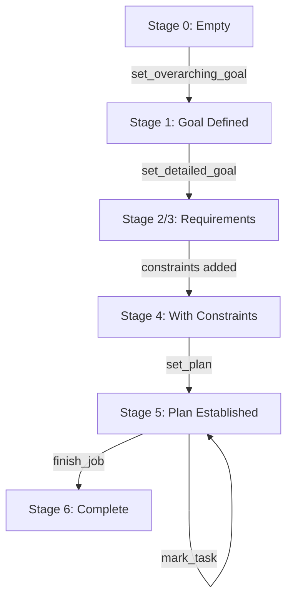
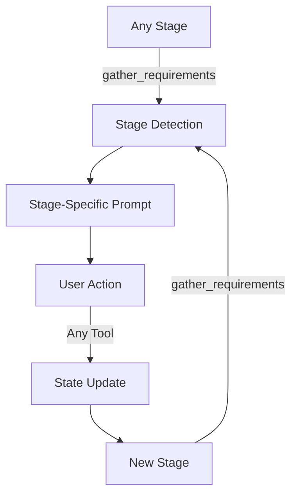
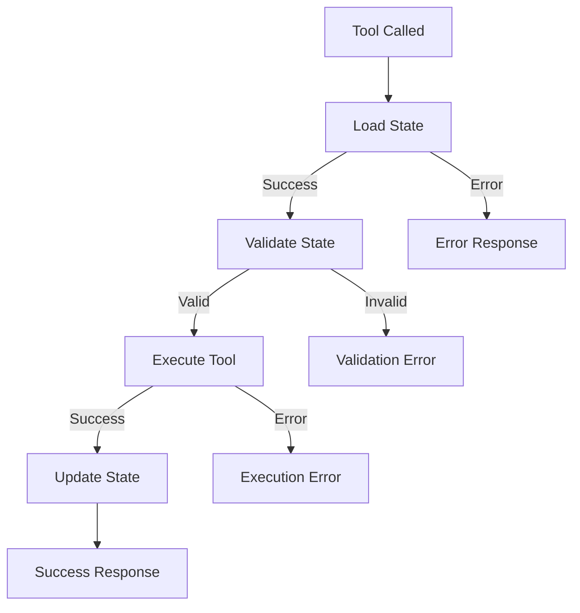

# Planner MCP - Parser Development Documentation

## Overview
A Model Context Protocol (MCP) server featuring a sophisticated state machine parser for structured commit messages and planning documents. This project evolved from a basic requirement enforcer to a comprehensive parsing system with hierarchical task management.

## Parser Grammar

### Formal Grammar Definition

The parser follows a structured grammar for commit messages and planning documents:

```ebnf
Document ::= Header ( NEWLINE NEWLINE Description )? ( NEWLINE Constraints )? ( NEWLINE Tasks )? ( NEWLINE Direction )?

Header ::= Type ( "(" Scope ")" )? Breaking? ":" ( " " Title )?
Type ::= [a-z]+
Scope ::= [^)\s]+
Breaking ::= "!"
Title ::= .+ (max 120 chars by default)

Description ::= Line ( NEWLINE Line )*
Line ::= [^\n]*

Constraints ::= Constraint ( NEWLINE Constraint )*
Constraint ::= "- " ConstraintKey ": " ConstraintValue
ConstraintKey ::= [A-Z][a-z ]*
ConstraintValue ::= [a-z].*

Tasks ::= Task ( NEWLINE Task )*
Task ::= Indent "- [" CheckBox "]: " TaskText
Indent ::= ( "  " )*  // 2 spaces per level by default
CheckBox ::= "x" | " "
TaskText ::= .+

Direction ::= .+
```

### Grammar Rules

1. **Document Structure**: Sequential sections with strict ordering
2. **Header Requirements**: Must be first line, type is mandatory
3. **Empty Line Separation**: Required between header and description
4. **Indentation**: Configurable (default 2 spaces) for task hierarchy
5. **Validation**: Length limits, pattern matching, nesting depth controls

### Regex Patterns

The parser uses configurable regex patterns for pattern matching:

```typescript
// Default header patterns
headerPatterns: {
  complete: /^([a-z]+)\(([^)\s]+)\)(!)?:\s*(.+)$/,     // type(scope)!: title
  typeScopeBreaking: /^([a-z]+)\(([^)\s]+)\)!:$/,      // type(scope)!:
  typeScope: /^([a-z]+)\(([^)\s]+)\):$/,               // type(scope):
  type: /^([a-z]+):.*$/,                               // type:
}

// Task pattern
taskPattern: /^(\s*)- \[([x ])\]: (.+)$/,             // indented - [x]: task

// Constraint pattern  
constraintPattern: /^- ([A-Z][a-z ]*): ([a-z].*)$/,   // - Key: value
```

### Pattern Matching Priority

1. **Complete Header**: `type(scope)!: title` (highest priority)
2. **Type+Scope+Breaking**: `type(scope)!:`
3. **Type+Scope**: `type(scope):`
4. **Type Only**: `type:` (lowest priority, catches remaining)

### Parsing Algorithm

The parser uses a sequential state machine approach:

1. **Header Parsing**: Pattern matching against configurable regex patterns
2. **Section Detection**: Sequential parsing of description → constraints → tasks → direction
3. **Validation**: Real-time validation with configurable limits and rules
4. **Hierarchy Building**: Two-phase task parsing (flat → hierarchical)
5. **Error Recovery**: Partial results with meaningful error states

### Validation Rules

| Rule | Default | Configurable |
|------|---------|--------------|
| Title Length | 120 chars | ✓ |
| Nesting Depth | 4 levels | ✓ |
| Task Count | 1000 tasks | ✓ |
| Input Length | 100KB | ✓ |
| Indentation | 2 spaces | ✓ |
| Direction Halt | 3 chars | ✓ |

### Examples

#### Basic Header Only
```
feat: Add new feature
```

#### Header with Scope and Breaking Change
```
feat(parser)!: Add hierarchical task support
```

#### Complete Document
```
feat(parser): Add hierarchical task support

This enhancement adds support for nested tasks with unlimited depth,
allowing complex project planning and requirement tracking.

- Must: Support unlimited nesting depth
- Should: Maintain performance with large task lists
- Must not: Break existing parsing functionality

- [x]: Implement basic task parsing
  - [x]: Add checkbox recognition
  - [ ]: Add nesting support
    - [x]: Parse indentation levels
    - [ ]: Build task hierarchy
- [ ]: Add validation rules
- [ ]: Update documentation

Continue with implementation phase
```

#### Invalid Examples (Cause Halted State)
```
// Missing empty line after header
feat: Title
Description starts immediately

// Invalid constraint format
feat: Title

- invalid constraint format

// Invalid task format
feat: Title

- [x]: Valid task
[x]: Invalid task (missing dash)
```

## Parser Architecture

### Core Components

The parser system consists of two main files:
- **`src/parse.ts`** (734 lines) - Main parser implementation
- **`src/parse.test.ts`** (498 lines) - Comprehensive test suite with 42 test cases

### State Machine Design

The parser implements a sophisticated state machine with the following states:
- `"empty"` - No content to parse
- `"unknown"` - Unrecognized content format
- `"parsed"` - Successfully parsed content
- `"halted"` - Parsing stopped due to validation errors or incomplete content

### Type System

#### Discriminated Union Types

The parser uses strict TypeScript discriminated unions for type safety:

```typescript
export type ParsedHeader =
  | { type: string; scope?: never; breaking: boolean; title?: never; }
  | { type: string; scope: string; breaking: boolean; title?: never; }
  | { type: string; scope: string; breaking: boolean; title: string; };

export type ParsedResult =
  | { state: "empty"; }
  | { state: "unknown"; }
  | { state: "parsed" | "halted"; }
  | { state: "parsed" | "halted"; header: ParsedHeader; description?: never; constraints?: never; tasks?: never; direction?: never; }
  // ... additional union variants for each parsing stage
```

#### Task Structure

Tasks are represented as recursive tuples supporting unlimited nesting:
```typescript
export type Task = [boolean, string, Task[]];
// [completed, description, children]
```

### Parser Configuration System

The parser is fully generic and configurable through the `ParserConfig` interface:

```typescript
export type ParserConfig = {
  maxTitleLength: number;
  indentSize: number;
  taskPattern: RegExp;
  constraintPattern: RegExp;
  directionHaltLength?: number;
  maxInputLength: number;
  maxNestingDepth: number;
  maxTaskCount: number;
  headerPatterns: {
    complete: RegExp;
    typeScopeBreaking: RegExp;
    typeScope: RegExp;
    type: RegExp;
  };
};
```

#### Predefined Configurations

The system includes several predefined configurations:
- **`COMMIT_MESSAGE`** - Default commit message format
- **`MARKDOWN_TASKS`** - Markdown task list format
- **`YAML_LIKE`** - YAML-style format
- **`STRICT`** - Strict validation rules

## Development Evolution

### Six Stages of Development

The parser evolved through test-driven development across six distinct stages:

#### Stage 1: Empty/Unknown States
- Basic state handling for empty input and unrecognized content
- Foundation for state machine architecture

#### Stage 2: Header Parsing
- Commit message header parsing: `type(scope): title`
- Support for breaking changes with `!` notation
- Title length validation with configurable limits
- Pattern matching for various header formats

#### Stage 3: Description Parsing
- Multi-line description support with strict empty-line validation
- Requirement for empty line after header before description
- Halt conditions for invalid description formatting

#### Stage 4: Constraint Parsing
- Key-value pair constraints in format `- Key: value`
- Strict pattern validation rejecting invalid keys/values
- Skipping malformed constraints instead of treating as direction

#### Stage 5: Task Parsing
- Hierarchical task structures with unlimited nesting
- Checkbox format: `- [x]: Task` (completed) or `- [ ]: Task` (pending)
- Configurable indentation handling (default 2 spaces)
- Complex nesting validation handling gaps in indentation levels

#### Stage 6: Direction Parsing
- Final section for additional instructions or notes
- Halt conditions based on configurable length limits
- Newline handling and validation

### Test-Driven Development Process

The parser development followed strict TDD principles:
- **42 comprehensive test cases** covering all parsing scenarios
- **100% test coverage** of parsing logic
- **Never edited test file** - tests drove implementation changes
- **Incremental complexity** - each stage built upon previous functionality

### Major Technical Challenges Solved

#### 1. Discriminated Union Type Alignment
**Challenge**: TypeScript's strict type system required precise alignment between type definitions and runtime behavior.

**Solution**: Implemented helper functions `createParsedHeader()` and `createParsedResult()` to ensure type-safe construction of discriminated union variants.

#### 2. Hierarchical Task Parsing
**Challenge**: Building nested task structures from flat indented text while handling irregular indentation patterns.

**Solution**: Two-phase parsing approach:
1. Parse tasks into flat structure with level information
2. Build hierarchy using recursive `buildTaskHierarchy()` function

#### 3. Type System Compliance
**Challenge**: Ensuring all 42 tests pass with 100% type safety while maintaining flexibility.

**Solution**: Comprehensive type guards and validation functions with proper error handling and partial result returns.

#### 4. Recent Specification Updates
**Challenge**: Adapting to updated test specifications for edge cases.

**Solutions**:
- Header parsing: `"fix: Description"` now ignores description in header-only parsing
- Constraint validation: Strict patterns reject invalid keys/values
- Invalid constraint handling: Skip malformed constraints instead of treating as direction

## Current Architecture Highlights

### Sequential Section Parsing
The parser processes sections in strict order:
1. **Header** - Required first line with type/scope/title
2. **Description** - Optional multi-line description after empty line
3. **Constraints** - Optional key-value pairs
4. **Tasks** - Optional hierarchical task lists
5. **Direction** - Optional final instructions

### Regex-Based Pattern Matching
All parsing uses configurable regex patterns for maximum flexibility:
- Header patterns for different commit formats
- Task patterns for checkbox syntax
- Constraint patterns for key-value validation

### Helper Functions
Type-safe construction utilities ensure discriminated union compliance:
- `createParsedHeader()` - Constructs valid header variants
- `createParsedResult()` - Constructs valid result variants
- `createConfig()` - Merges configuration overrides
- `validateConfig()` - Validates configuration parameters

### Security and Validation
- Input length limits to prevent DoS attacks
- Unsafe character detection (null bytes)
- Nesting depth limits to prevent stack overflow
- Task count limits for performance

## Parser vs Lexer Analysis

This component is correctly classified as a **parser** rather than a lexer based on:

### Parser Characteristics (Present)
- **Builds hierarchical data structures** - Creates nested task trees
- **Semantic validation** - Validates structure, limits, and relationships
- **State machine with context** - Tracks parsing state through document sections
- **Structural analysis** - Understands document structure and section relationships
- **Error recovery** - Returns partial results with meaningful error states

### Lexer Characteristics (Not Primary Focus)
- Simple tokenization into flat token streams
- Character-by-character scanning
- Basic pattern recognition without structure building

While the component performs lexical analysis (regex pattern matching), its primary purpose is parsing - transforming structured text into hierarchical data models with comprehensive semantic validation.

## Current Status

### Test Results
- ✅ **42/42 tests passing** (100% success rate)
- ✅ **All parsing stages functional** 
- ✅ **Type-safe implementation** with discriminated unions
- ✅ **Production-ready** parser architecture

### Performance Characteristics
- **Fast parsing** with single-pass algorithm
- **Memory efficient** with streaming approach
- **Configurable limits** for security and performance
- **Error recovery** with partial result returns

### Code Quality
- **734 lines** of well-structured TypeScript
- **Comprehensive documentation** with JSDoc comments
- **Modular design** with clear separation of concerns
- **Extensive validation** with proper error handling

## Future Enhancement Opportunities

While the parser is production-ready, potential areas for future development include:

1. **Performance Optimization** - For very large input documents
2. **Additional Format Support** - New predefined configurations
3. **Streaming Parser** - For real-time parsing of large documents
4. **Plugin Architecture** - Custom parsing extensions
5. **Error Recovery** - More sophisticated error correction

## Integration Points

The parser integrates with the broader MCP system through:
- **MCP Server** - Provides parsing capabilities via protocol
- **State Management** - Maintains parsing state across requests
- **Configuration Management** - Dynamic parser configuration
- **Result Processing** - Structured output for downstream systems

This parser represents a sophisticated, production-ready solution for structured document parsing with comprehensive validation, type safety, and configurability.

## Validation System

### Overview

The validation system (`src/validate.ts`) provides comprehensive validation for parsed document output using **Zod schemas**, ensuring grammar compliance and specific keyword validation according to the design specification. It includes automatic type inference and narrowing capabilities that provide stricter, more specific types after successful validation.

### Validation Features

#### Grammar Validation
- **Commit Types**: Validates against allowed types (`feat`, `fix`, `refactor`, `build`, `chore`, `docs`, `lint`, `infra`, `spec`)
- **Scope Patterns**: Enforces lowercase letters, numbers, and hyphens starting with a letter (`^[a-z][a-z0-9-]*$`)
- **Title Length**: Enforces maximum 120 character limit and no leading/trailing whitespace
- **Breaking Changes**: Validates boolean flag type

#### Constraint Validation
- **Valid Prefixes**: Enforces specific constraint prefixes (`Do not`, `Never`, `Avoid`, `Decide against`, `Must not`, `Cannot`, `Forbidden`)
- **Value Format**: Ensures constraint values start with lowercase letters
- **Non-empty Values**: Prevents empty constraint values

#### Task Validation
- **Structure Validation**: Ensures proper boolean completion flags and non-empty string descriptions
- **Nesting Depth**: Enforces maximum nesting depth of 4 levels (0-4)
- **Recursive Validation**: Validates entire task hierarchy including children

#### Type Validation
- **String Types**: Validates description and direction are strings when present
- **State Validation**: Only validates successfully parsed results (`state: "parsed"`)

### Zod Schema-Based Validation with Cascading Types

The validation system uses Zod schemas for robust, type-safe validation while maintaining the parser's cascading discriminated union structure:

```typescript
// Zod schemas for validation
const ValidatedCommitTypeSchema = z.enum(VALID_COMMIT_TYPES);
const ValidatedConstraintPrefixSchema = z.enum(VALID_CONSTRAINT_PREFIXES);

const ValidatedHeaderSchema = z.object({
  type: ValidatedCommitTypeSchema,
  scope: z.string().regex(SCOPE_PATTERN, "...").optional(),
  breaking: z.boolean(),
  title: z.string()
    .max(120, "Title exceeds 120 characters")
    .refine(val => val === val.trim(), "Title should not have leading or trailing whitespace")
    .optional(),
});

const ValidatedConstraintSchema = z.tuple([
  ValidatedConstraintPrefixSchema,
  z.string()
    .min(1, "Constraint value cannot be empty")
    .refine(val => val.length > 0 && val[0] === val[0].toLowerCase(), "Constraint value should start with lowercase")
]);

// Recursive task schema
const ValidatedTaskSchema: z.ZodType<ValidatedTaskType> = z.lazy(() =>
  z.tuple([
    z.boolean(),
    z.string().min(1, "Task description must be a non-empty string"),
    z.array(ValidatedTaskSchema)
  ])
);

// Main validation schema
const ValidatedParsedResultSchema = z.object({
  state: z.union([z.literal("parsed"), z.literal("halted")]),
  header: ValidatedHeaderSchema.optional(),
  description: z.string().optional(),
  constraints: z.array(ValidatedConstraintSchema).optional(),
  tasks: z.array(ValidatedTaskSchema).optional().refine(
    (tasks) => !tasks || validateTaskNestingDepth(tasks),
    { message: "Task nesting exceeds maximum depth of 4" }
  ),
  direction: z.string().optional(),
});
```

### Type Inference and Cascading Structure

The system combines Zod's automatic type inference with the parser's cascading discriminated union structure:

```typescript
// Types automatically inferred from Zod schemas
export type ValidatedCommitType = z.infer<typeof ValidatedCommitTypeSchema>;
export type ValidatedConstraintPrefix = z.infer<typeof ValidatedConstraintPrefixSchema>;
export type ValidatedHeader = z.infer<typeof ValidatedHeaderSchema>;
export type ValidatedConstraint = z.infer<typeof ValidatedConstraintSchema>;
export type ValidatedTask = ValidatedTaskType; // Recursive type

// Cascading discriminated union matching parser structure exactly
export type ValidatedParsedResult =
  | { state: "empty"; }
  | { state: "unknown"; }
  | { state: "parsed" | "halted"; }
  | { state: "parsed" | "halted"; header: ValidatedHeader; description?: never; constraints?: never; tasks?: never; direction?: never; }
  | { state: "parsed" | "halted"; header: ValidatedHeader; description: string; constraints?: never; tasks?: never; direction?: never; }
  | { state: "parsed" | "halted"; header: ValidatedHeader; description: string; constraints: ValidatedConstraint[]; tasks?: never; direction?: never; }
  | { state: "parsed" | "halted"; header: ValidatedHeader; description: string; constraints: ValidatedConstraint[]; tasks: ValidatedTask[]; direction?: never; }
  | { state: "parsed" | "halted"; header: ValidatedHeader; description: string; constraints: ValidatedConstraint[]; tasks: ValidatedTask[]; direction: string; };
```

This approach provides:
- **Zod Validation**: Robust runtime validation with detailed error messages
- **Cascading Types**: Exact TypeScript discriminated union structure matching the parser
- **Type Safety**: Compile-time guarantees about which fields are present at each stage

### Type Guard

The system includes a type guard function for safe type narrowing:

```typescript
export function isValidatedResult(
  parsed: ParsedResult, 
  validation: ValidationResult
): parsed is ValidatedParsedResult {
  return validation.isValid && parsed.state === "parsed";
}
```

### Error Reporting

Validation errors are automatically converted from Zod's structured error format:

```typescript
export type ValidationError = {
  field: string;      // Specific field path (e.g., "header.type", "constraints.0.0")
  message: string;    // Human-readable error message from Zod
  code: string;       // Standardized Zod error codes (INVALID_TYPE, TOO_BIG, CUSTOM, etc.)
};

// Zod provides standardized error codes:
// - INVALID_TYPE: Type mismatch (string vs number, etc.)
// - INVALID_VALUE: Invalid enum value
// - TOO_BIG/TOO_SMALL: Size/length violations
// - INVALID_FORMAT: Regex pattern failures
// - CUSTOM: Custom validation failures
```

### Warning System

The validation system provides warnings for best practices:
- Scope case warnings (suggests lowercase)
- Additional warnings can be added without breaking validation

### Usage Example

```typescript
import { parse } from "./parse.js";
import { validate, isValidatedResult } from "./validate.js";

const input = "feat(auth): implement OAuth2 flow";
const parsed = parse(input);
const validation = validate(parsed);

if (isValidatedResult(parsed, validation)) {
  // parsed is now typed as ValidatedParsedResult with Zod-inferred types
  // All fields are guaranteed to meet schema validation requirements
  console.log(parsed.header.type); // ValidatedCommitType (Zod-inferred)
}
```

### Benefits of Zod Integration

1. **Automatic Type Inference**: Types are automatically inferred from schemas, reducing duplication
2. **Standardized Error Codes**: Consistent error codes across all validation scenarios
3. **Composable Schemas**: Easy to extend and modify validation rules
4. **Runtime Safety**: Zod provides both compile-time and runtime type safety
5. **Rich Validation**: Built-in support for regex, refinements, custom validations, and more
6. **Better Error Messages**: Zod provides detailed, contextual error messages

### Test Coverage

The validation system includes comprehensive test coverage with 30 test cases covering:
- Invalid states (empty, unknown, halted)
- Missing headers
- Valid and invalid commit types
- Scope pattern validation
- Title validation (length, whitespace)
- Constraint validation (prefixes, values)
- Task validation (structure, nesting depth)
- Type validation for all fields
- Warning generation
- Complex document validation

This Zod-based validation system ensures that parsed documents meet all grammar and business rule requirements before being processed by downstream systems, while providing excellent TypeScript integration and developer experience.

## MCP Workflow System

### Overview

The MCP (Model Context Protocol) server implements a sophisticated 6-stage workflow system for requirements gathering and execution. This system guides users through a structured process from initial goal definition to complete implementation, with state persistence through Jujutsu commit descriptions.

### Workflow Architecture

The workflow system is built on several key principles:

- **Stage-Based Progression**: 6 distinct stages (0-6) representing different phases of requirements and execution
- **Fuzzy Schema Support**: Uses field presence detection rather than strict stage enforcement for flexibility
- **Resumable Workflow**: Can be resumed at any stage without losing progress
- **State Persistence**: All workflow state is stored in Jujutsu commit descriptions using structured format
- **Tool-Driven Interaction**: Each stage has corresponding MCP tools for state management

### Stage Definitions

#### Stage 0: Initial State
- **Purpose**: Empty or uninitialized workflow
- **Data Required**: None
- **Available Actions**: `set_overarching_goal`
- **Prompt**: Guides user to establish clear overarching goal
- **Transition**: Moves to Stage 1 when header is set

#### Stage 1: Overarching Goal Defined
- **Purpose**: Basic goal structure established
- **Data Required**: `header` (type, scope, breaking, title)
- **Available Actions**: `set_overarching_goal` (refinement), `set_detailed_goal`
- **Prompt**: Allows goal refinement or progression to detailed requirements
- **Transition**: Moves to Stage 2/3 when description is added

#### Stage 2/3: Detailed Goal Phase
- **Purpose**: Comprehensive requirements definition
- **Data Required**: `header` + `description`
- **Available Actions**: `set_detailed_goal`, `set_plan`
- **Prompt**: Detailed requirements gathering with reasons, targets, and approach
- **Transition**: Moves to Stage 4 when constraints are added, or Stage 5 when plan is set

#### Stage 4: Constraints Defined
- **Purpose**: Requirements with strategic constraints
- **Data Required**: `header` + `description` + `constraints`
- **Available Actions**: `set_plan`, constraint refinement
- **Prompt**: Plan definition with established constraints
- **Transition**: Moves to Stage 5 when tasks are added

#### Stage 5: Plan Established
- **Purpose**: Executable task breakdown defined
- **Data Required**: `header` + `description` + `constraints` + `tasks`
- **Available Actions**: `mark_task`, `finish_job`, plan refinement
- **Prompt**: Task execution guidance with systematic approach
- **Transition**: Moves to Stage 6 when execution begins

#### Stage 6: Execution/Completion
- **Purpose**: Active execution or completed workflow
- **Data Required**: Full workflow state + `directive` (optional)
- **Available Actions**: `mark_task`, `finish_job`
- **Prompt**: Continued execution or completion validation
- **Transition**: Workflow complete when all tasks finished

### Workflow State Management

#### State Persistence
```typescript
// State is stored in Jujutsu commit descriptions using format.ts
const commitDescription = format(workflowState);
await jj.description.replace(commitDescription);
```

#### State Loading
```typescript
// State is loaded and validated on each tool invocation
const result = await jj.description.get();
const parseResult = validate(parse(result.ok));
const currentState = parseResult.data;
```

#### Stage Detection
The system uses fuzzy schema detection based on field presence:
- Stage 0: No header
- Stage 1: Header only
- Stage 2/3: Header + description
- Stage 4: Header + description + constraints
- Stage 5: Header + description + constraints + tasks
- Stage 6: Full state + directive or completion marker

### Workflow Resumption

The workflow system supports resumption at any stage through several mechanisms:

#### Automatic Stage Detection
- `gather_requirements` tool analyzes current commit state
- Determines appropriate stage based on available data
- Provides stage-specific prompts and guidance

#### Flexible Tool Access
- All tools can be called at any stage for updates
- No strict stage enforcement prevents workflow modification
- Users can refine any part of the workflow at any time

#### State Validation
- Each tool validates current state before making changes
- Ensures data integrity across stage transitions
- Provides clear error messages for invalid operations

### Error Handling and Recovery

#### Simple Error Logging
- Errors are logged with clear messages to users
- No complex recovery mechanisms (by design constraint)
- Critical errors surface immediately with manual intervention guidance

#### State Consistency
- Format function handles partial states gracefully
- Validation ensures data integrity at each stage
- Jujutsu integration provides atomic state updates

### Integration Points

#### MCP Server Integration
- FastMCP framework provides tool infrastructure
- Structured tool definitions with Zod parameter validation
- Consistent response formatting across all tools

#### Jujutsu Integration
- Commit descriptions store complete workflow state
- Diff integration shows file changes in context
- Empty commit detection for workflow initialization

#### Parser Integration
- Uses existing parser system for commit description parsing
- Leverages validation system for state verification
- Benefits from fuzzy schema support for partial states

This workflow system provides a robust foundation for structured requirements gathering and execution, with the flexibility to adapt to various development scenarios while maintaining state consistency and user guidance throughout the process.

## MCP Tool Interface Specifications

### Overview

The MCP server exposes 6 tools that provide complete workflow management capabilities. Each tool is designed for specific workflow operations and includes comprehensive parameter validation, error handling, and state management.

### Tool Definitions

#### 1. gather_requirements

**Purpose**: Entry point for workflow analysis and stage detection

**Parameters**: None (empty object)

**Behavior**:
- Loads current commit state from Jujutsu
- Detects workflow stage based on available data
- Provides stage-appropriate prompts and guidance
- Includes file change context when modifications exist

**Return Type**: 
```typescript
{ content: Array<{ type: "text"; text: string }> } | { type: "text"; text: string }
```

**Usage Example**:
```typescript
// Always call first to understand current workflow state
const result = await mcpClient.callTool("gather_requirements", {});
```

**Error Conditions**:
- Jujutsu command failures
- Commit parsing/validation errors
- File diff retrieval errors

#### 2. set_overarching_goal

**Purpose**: Define or update the primary workflow objective

**Parameters**:
```typescript
{
  goal: {
    type: "feat" | "fix" | "refactor" | "build" | "chore" | "docs" | "lint" | "infra" | "spec";
    scope: string; // lowercase, letters/numbers/hyphens
    breaking: boolean;
    title: string; // max 120 chars, trimmed
  }
}
```

**Behavior**:
- Validates goal structure against Zod schema
- Updates workflow header in commit description
- Transitions workflow to Stage 1
- Provides guidance for next steps (detailed goal definition)

**Return Type**: `{ type: "text"; text: string }`

**Usage Example**:
```typescript
await mcpClient.callTool("set_overarching_goal", {
  goal: {
    type: "feat",
    scope: "mcp",
    breaking: false,
    title: "implement draft requirements gathering to execution workflow"
  }
});
```

**Error Conditions**:
- Invalid goal structure (type, scope pattern, title length)
- Jujutsu commit update failures
- State serialization errors

#### 3. set_detailed_goal

**Purpose**: Define comprehensive requirements with reasons, targets, and approach

**Parameters**:
```typescript
{
  description: string; // detailed requirements specification
}
```

**Behavior**:
- Adds detailed description to workflow state
- Transitions workflow to Stage 2/3
- Provides guidance for plan definition
- Maintains existing header information

**Return Type**: `{ type: "text"; text: string }`

**Usage Example**:
```typescript
await mcpClient.callTool("set_detailed_goal", {
  description: `Replace unmaintainable v1 MCP server with structured, testable v2 architecture.

TARGETS OF CHANGE:
1. Workflow Engine: 6-stage progression system
2. State Management: Jujutsu commit description integration
...

APPROACH TO CHANGE:
- Generic workflow engine architecture
- Tool-driven user interactions
...`
});
```

**Error Conditions**:
- Empty or invalid description
- State update failures
- Commit serialization errors

#### 4. set_plan

**Purpose**: Define executable task breakdown with hierarchical structure

**Parameters**:
```typescript
{
  plan: Array<[boolean, string, ValidatedTask[]]>; // recursive task structure
}
```

**Task Structure**:
```typescript
type ValidatedTask = [
  boolean,        // completion status
  string,         // task description
  ValidatedTask[] // subtasks (max 4 levels deep)
];
```

**Behavior**:
- Validates task structure and nesting depth (max 4 levels)
- Updates workflow with executable plan
- Transitions workflow to Stage 5
- Provides execution guidance

**Return Type**: `{ type: "text"; text: string }`

**Usage Example**:
```typescript
await mcpClient.callTool("set_plan", {
  plan: [
    [false, "Fix and stabilize existing draft implementation", [
      [false, "Repair syntax errors in format.ts", []],
      [false, "Fix return type inconsistencies", []]
    ]],
    [false, "Complete missing workflow implementation", []]
  ]
});
```

**Error Conditions**:
- Invalid task structure
- Nesting depth exceeds 4 levels
- Empty task descriptions
- State update failures

#### 5. mark_task

**Purpose**: Update task completion status during execution

**Parameters**:
```typescript
{
  task_id: string;           // partial match against task descriptions
  completed?: boolean;       // defaults to true
}
```

**Behavior**:
- Searches task hierarchy for matching description
- Updates completion status for found task
- Persists updated state to commit description
- Provides execution continuation guidance

**Return Type**: `{ type: "text"; text: string }`

**Usage Example**:
```typescript
// Mark task as complete
await mcpClient.callTool("mark_task", {
  task_id: "syntax errors",
  completed: true
});

// Mark task as incomplete
await mcpClient.callTool("mark_task", {
  task_id: "return type inconsistencies", 
  completed: false
});
```

**Error Conditions**:
- No tasks defined in workflow
- Task ID not found in hierarchy
- State update failures

#### 6. finish_job

**Purpose**: Complete the entire workflow when all tasks are finished

**Parameters**: None (empty object)

**Behavior**:
- Validates all tasks are marked complete
- Sets workflow directive to "COMPLETE"
- Transitions workflow to final Stage 6
- Provides completion confirmation

**Return Type**: `{ type: "text"; text: string }`

**Usage Example**:
```typescript
// Complete workflow when all tasks done
await mcpClient.callTool("finish_job", {});
```

**Error Conditions**:
- Incomplete tasks remaining
- No tasks defined
- State update failures

### Tool Integration Patterns

#### Workflow Initialization
```typescript
// 1. Check current state
await mcpClient.callTool("gather_requirements", {});

// 2. Set overarching goal
await mcpClient.callTool("set_overarching_goal", { goal: {...} });

// 3. Define detailed requirements
await mcpClient.callTool("set_detailed_goal", { description: "..." });

// 4. Create execution plan
await mcpClient.callTool("set_plan", { plan: [...] });
```

#### Task Execution
```typescript
// 1. Check current state and tasks
await mcpClient.callTool("gather_requirements", {});

// 2. Execute tasks and mark complete
await mcpClient.callTool("mark_task", { task_id: "first task" });
await mcpClient.callTool("mark_task", { task_id: "second task" });

// 3. Complete workflow
await mcpClient.callTool("finish_job", {});
```

#### Workflow Resumption
```typescript
// 1. Always start with requirements gathering
await mcpClient.callTool("gather_requirements", {});

// 2. System provides appropriate next steps based on current stage
// 3. Use relevant tools to continue from current state
```

### Error Handling Patterns

All tools follow consistent error handling:

```typescript
// Error response format
{
  type: "text",
  text: "An internal error occurred: <error_type> `<metadata>`\n\nMetadata:\n<detailed_info>\n\nThis is a CRITICAL ISSUE..."
}
```

**Common Error Types**:
- `command failed`: Jujutsu command execution errors
- `command non zero exit`: Jujutsu command returned error code
- `commit validation failed`: Parsed commit doesn't match schema
- `no tasks found`: Task operations on empty task list
- `task not found`: Task ID doesn't match any task descriptions
- `not all tasks complete`: Finish job called with incomplete tasks

### Tool Annotations

All tools include FastMCP annotations for client guidance:

```typescript
annotations: {
  title: "Human Readable Title",
  destructiveHint: boolean,    // true for state-changing operations
  readOnlyHint: boolean,       // true for read-only operations
  idempotentHint: boolean,     // true for safe-to-retry operations
  openWorldHint: false,        // always false for controlled workflow
  streamingHint: false,        // always false for atomic operations
}
```

This tool interface provides complete workflow management capabilities with robust error handling, flexible resumption, and comprehensive state management through the MCP protocol.

## Workflow State Transitions and Resumption Logic

### State Transition Architecture

The workflow system implements a sophisticated state management approach that prioritizes flexibility and resumability over strict enforcement. This design enables users to modify any aspect of their workflow at any time while maintaining data consistency.

### Fuzzy Schema Approach

#### Design Philosophy

Rather than enforcing strict stage progression, the system uses a "fuzzy schema" approach:

```typescript
// Field presence detection instead of stage enforcement
switch (true) {
  case !commit.header:
    return ""; // Stage 0: No header
  case !commit.description:
    return formatHeaderOnly(commit); // Stage 1: Header only
  case !commit.constraints:
    return formatHeaderAndDescription(commit); // Stage 2/3: Basic requirements
  case !commit.tasks:
    return formatWithConstraints(commit); // Stage 4: With constraints
  default:
    return formatComplete(commit); // Stage 5/6: Full workflow
}
```

#### Benefits of Fuzzy Schema

1. **Flexible Resumption**: Users can resume at any stage without strict validation
2. **Partial State Handling**: System gracefully handles incomplete workflows
3. **Non-Linear Progression**: Users can skip stages or return to previous stages
4. **Robust Error Recovery**: Malformed states don't break the entire workflow

### State Detection and Stage Mapping

#### Stage Detection Logic

The `gather_requirements` tool determines current stage through field analysis:

```typescript
async function detectWorkflowStage(commit: ValidatedParsed): Promise<number> {
  // Stage 0: Empty or no header
  if (!commit.header) return 0;
  
  // Stage 1: Header only
  if (!commit.description) return 1;
  
  // Stage 2/3: Header + description
  if (!commit.constraints) return commit.description ? 2 : 3;
  
  // Stage 4: Header + description + constraints
  if (!commit.tasks) return 4;
  
  // Stage 5: Header + description + constraints + tasks
  if (!commit.directive || commit.directive !== "COMPLETE") return 5;
  
  // Stage 6: Complete workflow
  return 6;
}
```

#### Stage-Specific Behavior

Each detected stage triggers appropriate prompts and available actions:

**Stage 0 → 1 Transition**:
```typescript
// Trigger: set_overarching_goal called
// Effect: Header added, moves to Stage 1
// Available: Goal refinement, detailed goal definition
```

**Stage 1 → 2/3 Transition**:
```typescript
// Trigger: set_detailed_goal called
// Effect: Description added, moves to Stage 2/3
// Available: Detailed goal refinement, plan definition
```

**Stage 2/3 → 4 Transition**:
```typescript
// Trigger: Constraints added (manual or through detailed goal)
// Effect: Constraints field populated, moves to Stage 4
// Available: Plan definition, constraint refinement
```

**Stage 4 → 5 Transition**:
```typescript
// Trigger: set_plan called
// Effect: Tasks added, moves to Stage 5
// Available: Task execution, plan refinement
```

**Stage 5 → 6 Transition**:
```typescript
// Trigger: finish_job called (all tasks complete)
// Effect: Directive set to "COMPLETE", moves to Stage 6
// Available: Workflow complete
```

### Resumption Mechanisms

#### Automatic State Recovery

When any tool is called, the system automatically:

1. **Loads Current State**: Retrieves commit description from Jujutsu
2. **Parses and Validates**: Uses parser and validation system
3. **Detects Stage**: Determines current workflow stage
4. **Provides Context**: Offers stage-appropriate guidance

```typescript
async function resumeWorkflow(): Promise<WorkflowContext> {
  // Load current state
  const commitResult = await jj.description.get();
  if (commitResult.err) throw new Error("Cannot load workflow state");
  
  // Parse and validate
  const parseResult = validate(parse(commitResult.ok));
  if (!parseResult.isValid) throw new Error("Invalid workflow state");
  
  // Detect stage and provide context
  const stage = detectWorkflowStage(parseResult.data);
  const context = generateStageContext(stage, parseResult.data);
  
  return { stage, data: parseResult.data, context };
}
```

#### Resumption at Any Stage

**Stage 0 Resumption** (Empty Workflow):
- System detects no header
- Prompts for overarching goal definition
- Provides goal establishment guidance

**Stage 1 Resumption** (Goal Defined):
- System detects header only
- Shows current goal
- Offers goal refinement or detailed requirements

**Stage 2/3 Resumption** (Requirements Defined):
- System detects header + description
- Shows current requirements
- Offers requirements refinement or plan creation

**Stage 4 Resumption** (Constraints Added):
- System detects header + description + constraints
- Shows current requirements with constraints
- Offers plan creation or constraint refinement

**Stage 5 Resumption** (Plan Established):
- System detects full workflow with tasks
- Shows current plan and progress
- Offers task execution or plan refinement

**Stage 6 Resumption** (Workflow Complete):
- System detects completed workflow
- Shows completion status
- Offers workflow review or new workflow initiation

### State Persistence Mechanisms

#### Commit Description Storage

All workflow state is stored in Jujutsu commit descriptions using structured format:

```typescript
// State serialization
const serializedState = format(workflowState);
await jj.description.replace(serializedState);

// Example serialized state
`feat(mcp): implement draft requirements gathering to execution workflow

Replace unmaintainable v1 MCP server with structured, testable v2 architecture.

TARGETS OF CHANGE:
1. Workflow Engine: 6-stage progression system
2. State Management: Jujutsu commit description integration

APPROACH TO CHANGE:
- Generic workflow engine architecture
- Tool-driven user interactions

- Do not: implement complex error recovery mechanisms
- Never: add performance optimizations in this iteration

- [x]: Fix and stabilize existing draft implementation
  - [x]: Repair syntax errors in format.ts
  - [x]: Fix return type inconsistencies
- [ ]: Complete missing workflow implementation
  - [ ]: Add proper stage transition validation

~~~ EXECUTE ~~~`
```

#### Atomic State Updates

Each tool operation performs atomic state updates:

```typescript
async function updateWorkflowState(updater: (state: ValidatedParsed) => void): Promise<Result> {
  // 1. Load current state
  const current = await loadCommit(jj);
  if (current.err) return current;
  
  // 2. Apply update
  updater(current.ok);
  
  // 3. Serialize and persist
  const serialized = format(current.ok);
  const result = await jj.description.replace(serialized);
  
  // 4. Return result
  return result.err ? result : Ok("State updated successfully");
}
```

#### State Consistency Guarantees

1. **Parse-Format Roundtrip**: `parse(format(state)) === state`
2. **Validation Integrity**: All persisted states pass validation
3. **Atomic Updates**: State changes are all-or-nothing
4. **Error Recovery**: Failed updates don't corrupt existing state

### Transition Flow Examples

#### Complete Workflow Flow



#### Non-Linear Resumption Flow



#### Error Recovery Flow



### Resumption Best Practices

#### For Users

1. **Always Start with gather_requirements**: Understand current state before taking action
2. **Review Current State**: Check what's already defined before making changes
3. **Incremental Updates**: Make small, focused changes rather than large rewrites
4. **Validate Progress**: Use gather_requirements to confirm changes took effect

#### For Developers

1. **Idempotent Operations**: Tools should be safe to call multiple times
2. **Graceful Degradation**: Handle partial states without errors
3. **Clear Error Messages**: Provide actionable feedback for failures
4. **State Validation**: Always validate state before and after operations

This resumption system provides maximum flexibility while maintaining data integrity, enabling users to work with workflows in a natural, non-linear fashion while ensuring consistent state management throughout the process.

## Architectural Decisions for v2 Implementation

### Overview

The v2 MCP server represents a complete architectural redesign driven by the limitations and maintainability issues of the v1 "vibe coded" implementation. This section documents the key architectural decisions, their rationale, and the trade-offs considered during the v2 design process.

### Core Architectural Principles

#### 1. Systematic Structure Over "Vibe Coding"

**Decision**: Implement a formal, structured architecture with clear separation of concerns

**Rationale**: 
- v1 was "vibe coded" without systematic structure, making it difficult to maintain and extend
- Need for predictable, testable, and maintainable codebase
- Enable future architectural decisions through solid foundation

**Trade-offs**:
- ✅ **Pros**: Maintainable, testable, extensible, clear responsibilities
- ❌ **Cons**: More initial development time, higher complexity for simple operations
- **Decision**: Prioritize long-term maintainability over short-term development speed

#### 2. Generic Workflow Engine Architecture

**Decision**: Build a generic, configurable workflow engine rather than domain-specific solution

**Rationale**:
- Enable reuse across different types of requirements gathering scenarios
- Provide foundation for future workflow types beyond current use case
- Separate workflow logic from domain-specific concerns

**Alternatives Considered**:
- **Domain-Specific Engine**: Faster to implement but limited reusability
- **External Workflow Engine**: More features but additional dependency complexity
- **Generic Engine**: Chosen for balance of flexibility and simplicity

**Implementation**:
```typescript
// Generic stage-based workflow with configurable prompts and tools
const workflowEngine = {
  stages: configurable,
  transitions: flexible,
  persistence: pluggable,
  validation: schema-based
};
```

### Technology Stack Decisions

#### 1. FastMCP Framework

**Decision**: Use FastMCP for MCP server implementation

**Rationale**:
- Provides robust MCP protocol implementation
- Built-in tool management and parameter validation
- TypeScript-first design aligns with project goals
- Active development and community support

**Alternatives Considered**:
- **Custom MCP Implementation**: More control but significant development overhead
- **Other MCP Frameworks**: Limited options, FastMCP most mature
- **FastMCP**: Chosen for maturity, TypeScript support, and feature completeness

#### 2. Zod for Schema Validation

**Decision**: Use Zod for all parameter and state validation

**Rationale**:
- Type-safe validation with automatic TypeScript inference
- Composable schemas enable complex validation logic
- Excellent error messages for debugging and user feedback
- Runtime and compile-time type safety

**Alternatives Considered**:
- **Manual Validation**: More control but error-prone and verbose
- **JSON Schema**: Standard but lacks TypeScript integration
- **Joi/Yup**: Mature but less TypeScript-native
- **Zod**: Chosen for TypeScript-first design and type inference

**Implementation**:
```typescript
// Automatic type inference from schemas
const ValidatedHeader = z.object({
  type: z.enum(["feat", "fix", ...]),
  scope: z.string().regex(/^[a-z][a-z0-9/.-]*$/),
  breaking: z.boolean(),
  title: z.string().max(120)
});
type ValidatedHeader = z.infer<typeof ValidatedHeader>; // Automatic typing
```

#### 3. Jujutsu for State Persistence

**Decision**: Use Jujutsu commit descriptions for workflow state storage

**Rationale**:
- Leverages existing version control for state management
- Provides atomic updates and history tracking
- Integrates naturally with development workflow
- No additional database or storage dependencies

**Alternatives Considered**:
- **File System Storage**: Simple but lacks atomicity and history
- **Database Storage**: Robust but adds dependency complexity
- **Git Integration**: Similar benefits but Jujutsu provides better API
- **Jujutsu**: Chosen for atomic operations, history, and integration simplicity

**Implementation**:
```typescript
// Atomic state updates through commit descriptions
await jj.description.replace(format(newState));
```

### Design Pattern Decisions

#### 1. Fuzzy Schema vs Strict Stage Enforcement

**Decision**: Implement fuzzy schema with field presence detection

**Rationale**:
- Enables flexible workflow resumption at any stage
- Handles partial states gracefully without errors
- Allows non-linear workflow progression
- Reduces user frustration with strict validation

**Alternatives Considered**:
- **Strict Stage Enforcement**: Simpler logic but inflexible user experience
- **State Machine Pattern**: More formal but complex for user modifications
- **Fuzzy Schema**: Chosen for user experience and flexibility

**Implementation**:
```typescript
// Field presence detection instead of stage validation
switch (true) {
  case !commit.header: return handleStage0();
  case !commit.description: return handleStage1();
  case !commit.tasks: return handleStage4();
  default: return handleComplete();
}
```

#### 2. Tool-Driven Architecture

**Decision**: Expose workflow operations through discrete MCP tools

**Rationale**:
- Clear separation of concerns for each operation
- Enables atomic operations with proper error handling
- Provides natural API boundaries for testing
- Aligns with MCP protocol design principles

**Alternatives Considered**:
- **Monolithic Tool**: Single tool with operation parameters - less clear boundaries
- **REST API**: More familiar but doesn't leverage MCP protocol benefits
- **Tool-Driven**: Chosen for clarity, atomicity, and MCP alignment

#### 3. Result Type Pattern

**Decision**: Use Result types (Ok/Err) for error handling

**Rationale**:
- Explicit error handling without exceptions
- Type-safe error propagation
- Clear distinction between success and failure cases
- Functional programming benefits

**Implementation**:
```typescript
type Result<T, E> = Ok<T> | Err<E>;

// Explicit error handling
const result = await operation();
if (result.err) {
  return handleError(result);
}
// result.ok is guaranteed to exist
```

### Constraint Decisions

#### 1. Simple Error Handling

**Decision**: Implement simple error logging without complex recovery mechanisms

**Rationale**:
- Reduces implementation complexity significantly
- Aligns with v2 foundation goals (not production system)
- Enables faster development and testing
- Complex recovery can be added in future iterations

**Trade-offs**:
- ✅ **Pros**: Simple implementation, clear error messages, fast development
- ❌ **Cons**: Manual intervention required for some errors
- **Decision**: Prioritize simplicity for v2 foundation

#### 2. No Performance Optimization

**Decision**: Avoid performance optimizations in v2 implementation

**Rationale**:
- Premature optimization conflicts with foundation goals
- Current use cases don't require high performance
- Optimization adds complexity that conflicts with maintainability
- Can be added later when performance requirements are clear

**Trade-offs**:
- ✅ **Pros**: Simpler code, faster development, easier debugging
- ❌ **Cons**: May not scale to large workflows
- **Decision**: Optimize for developer experience over runtime performance

#### 3. Minimal Testing Infrastructure

**Decision**: Maintain existing tests without comprehensive new test suite

**Rationale**:
- Existing parser and validation tests provide solid foundation
- Comprehensive testing would significantly increase development time
- Manual testing sufficient for v2 foundation validation
- Full test suite can be added in future iterations

**Implementation Strategy**:
- Ensure existing tests continue to pass
- Add minimal tests only for new workflow functionality
- Focus on end-to-end workflow validation over unit test coverage

### Integration Architecture Decisions

#### 1. Parser System Reuse

**Decision**: Leverage existing parser system for commit description parsing

**Rationale**:
- Existing parser is production-ready with comprehensive test coverage
- Provides robust parsing with error recovery
- Maintains consistency with existing document format
- Avoids reimplementing complex parsing logic

**Benefits**:
- 42 existing test cases provide confidence
- Handles edge cases and malformed input gracefully
- Supports hierarchical task structures
- Configurable for different document formats

#### 2. Validation System Integration

**Decision**: Build on existing Zod-based validation system

**Rationale**:
- Existing validation provides comprehensive schema enforcement
- Type-safe validation with automatic inference
- Extensible for new workflow requirements
- Consistent error reporting across system

**Extension Strategy**:
- Add workflow-specific validation schemas
- Maintain compatibility with existing parser output
- Extend type definitions for new workflow concepts

### Future Architecture Considerations

#### Planned Extensions

1. **Performance Optimization**: When scale requirements become clear
2. **Complex Error Recovery**: When user experience demands it
3. **Additional Workflow Types**: When generic engine proves valuable
4. **Comprehensive Testing**: When stability requirements increase

#### Architecture Flexibility

The v2 architecture is designed to support future extensions:

- **Modular Design**: Clear separation enables component replacement
- **Generic Patterns**: Workflow engine can support different domains
- **Extensible Validation**: Schema-based validation easily extended
- **Pluggable Persistence**: Jujutsu integration can be abstracted

### Lessons from v1 Implementation

#### Problems Addressed

1. **"Vibe Coded" Structure**: Replaced with systematic, documented architecture
2. **Maintenance Difficulty**: Clear separation of concerns and documentation
3. **Extension Challenges**: Generic patterns enable future development
4. **Testing Gaps**: Foundation for comprehensive testing infrastructure

#### Design Principles Derived

1. **Systematic Over Intuitive**: Formal patterns over ad-hoc solutions
2. **Documentation First**: Architecture decisions documented for future reference
3. **Type Safety**: Comprehensive TypeScript usage for compile-time guarantees
4. **Separation of Concerns**: Clear boundaries between components
5. **Testability**: Architecture designed to support comprehensive testing

This architectural foundation provides a solid base for future development while addressing the core maintainability and extensibility issues that plagued the v1 implementation.